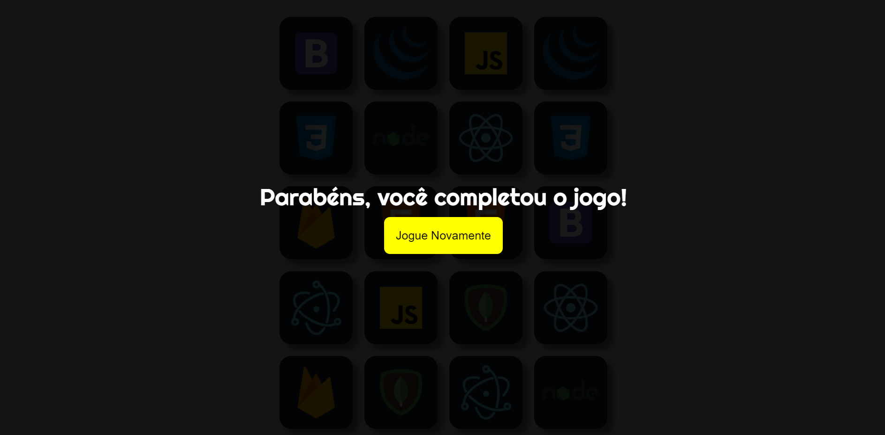

# Jogo da Memória

## Tela Inicial

## Jogo

## Tela Final

* 2º projeto feito em HTML, CSS e JavaScript.
* Projeto desenvolvido no curso Desenvolvimento Web Full Stack - ProgBr.
* Partes Implementadas por mim: Tela Inicial, Tela Final e Temporizador para Decorar as cartas.